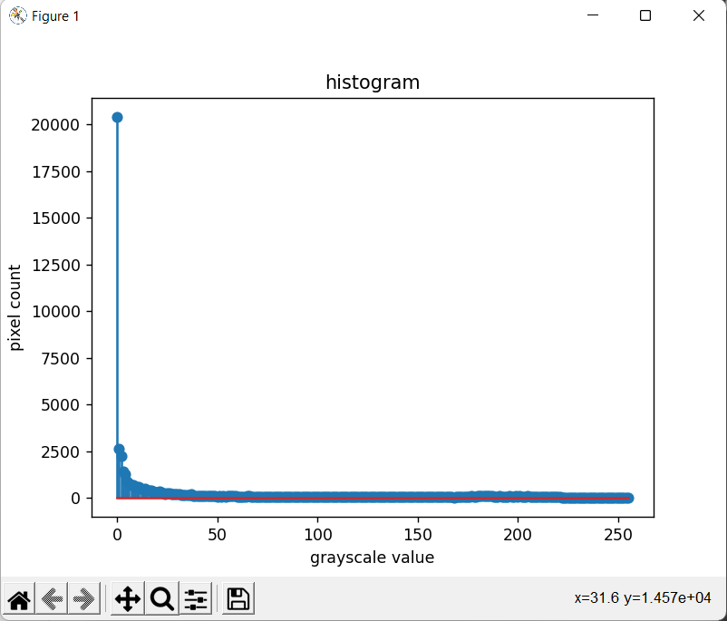

# Histogram and Histogram Equalization of an image
## Aim
To obtain a histogram for finding the frequency of pixels in an Image with pixel values ranging from 0 to 255. Also write the code using OpenCV to perform histogram equalization.

## Software Required:
Anaconda - Python 3.7

## Algorithm:
### Step1:
Import the necessary libraries and read two images, Color image and Gray Scale image.

### Step2:
Calculate the Histogram of Gray scale image and each channel of the color image.

### Step3:
Display the histograms with their respective images.

### Step4:
Equalize the grayscale image.

### Step5:
Display the grayscale image.

## Program:
```python
# Developed By:P.Siva Naga Nithin
# Register Number:212221240037
import cv2
import matplotlib.pyplot as plt

# Write your code to find the histogram of gray scale image and color image channels.
gray_image=cv2.imread('grayscaleimage.jpeg')
hist=cv2.calcHist([gray_image],[0],None,[256],[0,256])
plt.imshow(gray_image)
plt.show()
plt.figure()
plt.title("histogram")
plt.xlabel('grayscale value')
plt.ylabel('pixel count')
plt.stem(hist)
plt.show()


import cv2
import matplotlib.pyplot as plt

# Display the histogram of gray scale image and any one channel histogram from color image.
color_image=cv2.imread('car.jpeg')
hist=cv2.calcHist([color_image],[0],None,[256],[0,256])
plt.imshow(color_image)
plt.show()
plt.figure()
plt.title("histogram")
plt.xlabel('colorscale value')
plt.ylabel('pixel count')
plt.stem(hist)
plt.show()


import cv2
import matplotlib.pyplot as plt
# Write the code to perform histogram equalization of the image.
gray_image = cv2.imread('gray.jpg',0)
equ=cv2.equalizeHist(gray_image)
cv2.imshow('Gray image',gray_image)
cv2.imshow('Equalized Image',equ)
cv2.waitKey(0)
cv2.destroyAllWindows()


```
## Output:
### Input Grayscale Image and Color Image




### Histogram of Grayscale Image and any channel of Color Image


### Histogram Equalization of Grayscale Image


## Result: 
Thus the histogram for finding the frequency of pixels in an image with pixel values ranging from 0 to 255 is obtained. Also,histogram equalization is done for the gray scale image using OpenCV.
